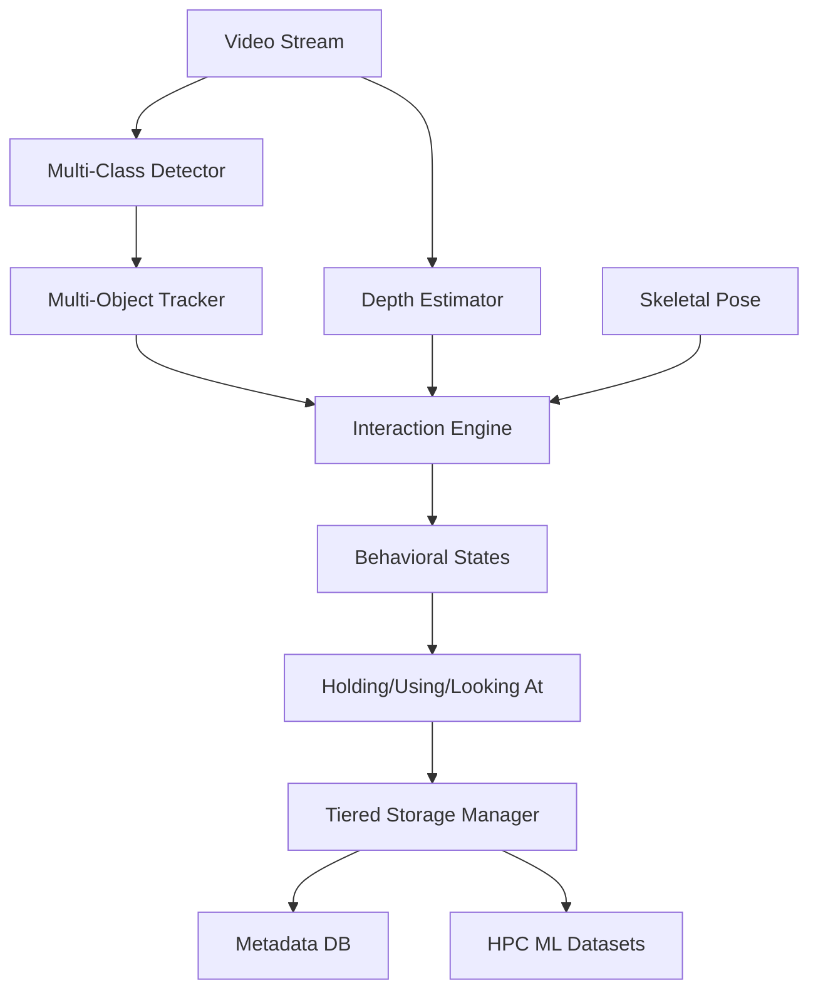

# SignVerse - 3D Physical Intelligence & HOI Platform


SignVerse is a high-fidelity physical intelligence platform designed for **Human-Object Interaction (HOI)** diagnostics, 3D behavioral analytics, and scalable motion persistence. It transforms monocular video streams into metric 3D intelligence, bridging the gap between raw perception and actionable behavioral intent.

## 🚀 Key Modules

### 🔍 Perception & Intelligence
- **HOI Multi-Class Detection**: Detects persons and 80+ object categories (Fitness, Tools, Kitchen, Office) using YOLOv8.
- **Unified Multi-Object Tracking**: Persistent identity mapping for persons (P1, P2) and objects (O1, O2) with Hungarian ROI association.
- **Monocular 3D Awareness**: Monocular depth estimation using MiDaS/DPT, providing metric-relative spatial mapping and point cloud synthesis.
- **Intention Understading Engine**: Behavioral diagnostics for `holding`, `touching`, `using`, and `looking_at` states via spatial-temporal fusion.

### 📊 Tiered Storage Architecture
- **Archival Tier (Files)**: Raw video and JSON pose ingestion.
- **Indexing Tier (Database)**: Structured SQLAlchemy/PostgreSQL layer for rapid behavioral and temporal queries.
- **Performance Tier (HPC)**: Vectorized **Parquet/HDF5** datasets with SNAPPY compression, optimized for high-throughput ML training (PyTorch/TF).

### 📐 Physical Diagnostics
- **Coordinate Normalization**: Scale-invariant and rotation-aligned skeleton frames (Hip-center referencing).
- **Temporal Verification**: Trajectory smoothing and gap interpolation for missing behavioral data.

## 🏗️ Intelligence Pipeline



## 🛠️ Quick Start

### 1. Ingest Video Pipeline
```bash
python -m examples.pipeline_usage
```

### 2. Run Behavioral Tests
```bash
./scripts/run_tests.sh
```

## 📚 Technical Documentation
- [HOI Platform Specs](docs/hoi_platform.md) - Perception-to-Intention architecture
- [Tiered Storage Manager](docs/tiered_storage.md) - High-performance data persistence
- [System Workflow](docs/system_workflow.md) - End-to-end data processing
- [Architecture Overview](docs/architecture.md) - Core system design

## 📄 License
This project is licensed under the MIT License - see the [LICENSE](LICENSE) file for details.

## 🙏 Acknowledgments
- **isl-org/MiDaS**: For state-of-the-art monocular depth estimation.
- **Ultralytics**: For high-speed detection and tracking.
- **MediaPipe**: For the foundation of holistic pose sensing.
