# Perception Core Architecture

## Overview

The SignVerse Perception Core is a high-fidelity vision-to-motion engine designed for sub-millisecond real-time gesture tracking and 3D pose reconstruction. This document details the architectural layers and data flow within the perception system.

## Architecture Diagram

```mermaid
flowchart TD
    A[Video Input] --> B[Detection Layer]
    
    subgraph B [Detection Layer]
        B1[YOLOv8 Person Detection]
        B2[Bounding Box Generation]
        B3[Confidence Filtering<br/>min_confidence: 0.6]
    end
    
    B -->|Bounding Boxes| C[Tracking Layer]
    
    subgraph C [Tracking Layer]
        C1[ByteTrack Multi-Object Tracking]
        C2[ID Assignment<br/>Person_1, Person_2]
        C3[Temporal Consistency<br/>30fps]
        C4[Occlusion Handling]
    end
    
    C -->|Tracked Persons| D[Pose Estimation Layer]
    
    subgraph D [Pose Estimation Layer]
        D1[MediaPipe Holistic Pipeline]
        D2[Body Pose<br/>33 keypoints]
        D3[Hands<br/>21×2 keypoints]
        D4[Face<br/>468 landmarks]
        D5[Head Pose<br/>6DoF estimation]
    end
    
    D -->|Raw Keypoints| E[Feature Extraction Layer]
    
    subgraph E [Feature Extraction Layer]
        E1[Velocity Calculation<br/>px/frame]
        E2[Acceleration Analysis]
        E3[Gesture Recognition]
        E4[Expression Classification]
        E5[Action Pattern Detection]
    end
    
    E -->|Enhanced Features| F[Normalization Layer]
    
    subgraph F [Normalization Layer]
        F1[Coordinate Transformation<br/>World Space]
        F2[Scale Normalization<br/>Height-based]
        F3[Missing Data Interpolation]
        F4[Temporal Smoothing<br/>Kalman Filter]
        F5[Confidence Weighting]
    end
    
    F -->|Structured Pose Data| G[Storage Layer]
    
    subgraph G [Storage Layer]
        G1[Real-time Database<br/>Redis Streams]
        G2[Structured Storage<br/>PostgreSQL]
        G3[File System<br/>JSON/Parquet]
        G4[Query Interface<br/>SQL/GraphQL]
    end
    
    G --> H[Downstream Systems]
    
    subgraph H [Consumer Systems]
        H1[Training Pipelines]
        H2[Blender Simulation]
        H3[Robotic Control]
        H4[Real-time Visualization]
    end
```

## Layers and Components

### 1. Detection Layer
- **YOLOv8**: Utilized for ultra-fast, high-precision person detection within the video feed.
- **Confidence Filtering**: Employs a minimum confidence threshold of **0.6** to ensure only reliable person detections are passed to the tracking layer.

### 2. Tracking Layer
- **ByteTrack**: A multi-object tracking (MOT) algorithm that maintains IDs across frames, even through heavy occlusions.
- **ID Assignment**: Assigns persistent IDs (e.g., `Person_1`, `Person_2`) to tracked entities.
- **Temporal Consistency**: Optimized for **30fps** video capture and processing.

### 3. Pose Estimation Layer
- **MediaPipe Holistic**: A unified pipeline for simultaneous body pose, hand tracking, and facial landmark detection.
- **Body Pose**: Extracts 33 skeletal keypoints.
- **Hands**: Captures 21 keypoints per hand (42 total).
- **Face**: Detects 468 facial landmarks for expression analysis.
- **Head Pose**: Provides 6 Degrees of Freedom (6DoF) head orientation.

### 4. Feature Extraction Layer
- **Velocity/Acceleration**: Calculates dynamic motion patterns in pixels per frame.
- **Gesture Recognition**: Identifies discrete hand and arm signals for sign language.
- **Expression Classification**: Maps facial landmarks to emotional states.
- **Action Pattern Detection**: Recognizes complex temporal sequences and activities.

### 5. Normalization Layer
- **Coordinate Transformation**: Maps pixel-space coordinates into a consistent 3D World Space.
- **Scale Normalization**: Rescales pose data based on detected height for cross-individual comparison.
- **Temporal Smoothing**: Employs **Kalman Filters** to reduce jitter and interpolate missing data.
- **Confidence Weighting**: Weighs keypoints by their detection confidence during normalization.

### 6. Storage Layer
- **Redis Streams**: Provides a low-latency buffer for real-time downstream consumers.
- **PostgreSQL**: Stores metadata and historical pose archives.
- **JSON/Parquet**: Persists raw keypoint data for long-form analysis and training.

### 7. Consumer Systems
- **Training Pipelines**: Uses normalized data for refining ML models.
- **Blender Simulation**: Drives 3D avatars for visual verification.
- **Robotic Control**: Translates gestures into physical robot motions.
- **Real-time Visualization**: Powers the SignVerse Dashboard's live tactical view.
