# SignVerse System Workflow

This diagram illustrates the complete end-to-end data processing workflow for the SignVerse system, from raw video ingestion to 3D animation and robotic integration.

```mermaid
flowchart TD
    A[YouTube Videos] -->|URL Input| B[Ingestion Pipeline]
    
    subgraph B [Ingestion Pipeline]
        B1[YouTube Scraper]
        B2[Video Downloader]
        B3[Metadata Extraction]
        B4[Quality Validation]
    end
    
    B -->|Video File| C[Frame Extraction]
    
    subgraph C [Frame Extraction]
        C1[Video Decoding]
        C2[Frame Sampling<br/>30 FPS]
        C3[Resolution Normalization<br/>1280x720]
        C4[Format Conversion<br/>JPEG/PNG]
    end
    
    C -->|Frames| D[Pose Estimation]
    
    subgraph D [Pose Estimation]
        D1[MediaPipe Pose<br/>Real-time]
        D2[OpenPose<br/>High Accuracy]
        D3[Custom Transformer<br/>Research]
        D4[3D Triangulation<br/>Multi-camera]
    end
    
    D -->|2D/3D Keypoints| E[Joint Normalization]
    
    subgraph E [Joint Normalization]
        E1[Coordinate Transformation<br/>World Space]
        E2[Scale Normalization<br/>Height-based]
        E3[Missing Data Interpolation]
        E4[Temporal Smoothing<br/>Savitzky-Golay]
    end
    
    E -->|Normalized Poses| F[Labeling]
    
    subgraph F [Labeling]
        F1[Manual Annotation<br/>Web Interface]
        F2[Auto-labeling<br/>Rule-based]
        F3[Action Recognition<br/>LSTM/Transformer]
        F4[Quality Validation]
    end
    
    F -->|Labeled Sequences| G[Dataset Creation]
    
    subgraph G [Dataset Creation]
        G1[Train/Val/Test Split<br/>70/15/15]
        G2[Data Augmentation<br/>Rotation/Scale/Noise]
        G3[Manifest Generation<br/>JSON Metadata]
        G4[Version Control<br/>DVC]
    end
    
    G -->|Curated Dataset| H[Model Training]
    
    subgraph H [Model Training]
        H1[Pose Refinement<br/>Transformer]
        H2[Action Classification<br/>LSTM]
        H3[Sequence Prediction<br/>GAN]
        H4[Hyperparameter Optimization]
    end
    
    H -->|Trained Model| I[Inference]
    
    subgraph I [Inference]
        I1[Real-time Processing<br/>Optimized]
        I2[Batch Processing<br/>High-throughput]
        I3[Confidence Thresholding<br/>0.5]
        I4[Result Caching<br/>Redis]
    end
    
    I -->|Refined Poses| J[Blender Simulation]
    
    subgraph J [Blender Simulation]
        J1[Skeleton Rigging<br/>Humanoid]
        J2[Inverse Kinematics<br/>IK Solver]
        J3[Physics Constraints<br/>Joint Limits]
        J4[Animation Generation<br/>Keyframes]
    end
    
    J -->|3D Animation| K[Export]
    
    subgraph K [Export Formats]
        K1[Robotic Control<br/>JSON Joint Angles]
        K2[3D Animation<br/>FBX/BVH/GLB]
        K3[Visualization<br/>WebGL/Three.js]
        K4[Documentation<br/>PDF/Video]
    end
    
    K --> L[Robotics Integration]
    K --> M[Web Visualization]
    K --> N[Research Analysis]
```



## Detailed Workflow Breakdown

### 1. YouTube Videos Input

*   **Input**: YouTube URLs or video files
*   **Components**: `ingestion/youtube_scraper.py`, `ingestion/downloader.py`
*   **Output**: MP4/AVI/MOV files in `data/raw/youtube_videos/`
*   **Parameters**:
    *   Max duration: 300 seconds
    *   Resolution: 720p preferred
    *   Format: MP4 (H.264)

```bash
# Example: Download YouTube video
python scripts/download_data.py youtube "https://youtube.com/watch?v=abc123"
```

### 2. Ingestion Pipeline

*   **Process**: Validate and prepare incoming videos
*   **Components**: `pipelines/ingestion/`, `core/data_manager.py`
*   **Validation**:
    *   File format check
    *   Duration limits (1-300s)
    *   Resolution validation
    *   Metadata extraction

```yaml
# configs/pipeline.yaml
ingestion:
  youtube:
    max_duration: 300
    max_filesize: 500000000  # 500MB
    resolution: "720p"
```

### 3. Frame Extraction

*   **Process**: Extract frames at consistent intervals
*   **Components**: `pipelines/preprocessing/frame_extractor.py`
*   **Parameters**:
    *   FPS: 30 frames per second
    *   Format: JPEG (95% quality)
    *   Resolution: 1280x720 (maintain aspect ratio)

```python
# Frame extraction configuration
frames = extract_frames(
    video_path, 
    fps=30, 
    output_dir="data/processed/frames/",
    quality=95
)
```

### 4. Pose Estimation

*   **Models**: Multiple model support with fallback
*   **Components**: `pipelines/pose_estimation/`, `models/inference/`
*   **Model Selection**:
    *   **MediaPipe**: Real-time (30+ FPS)
    *   **OpenPose**: High accuracy (8-10 FPS)
    *   **Custom Transformer**: Best accuracy (2-5 FPS)

```python
# Pose estimation configuration
pose_data = estimate_poses(
    frames,
    model_name="mediapipe",  # "mediapipe", "openpose", "transformer"
    confidence_threshold=0.5,
    include_3d=True
)
```

### 5. Joint Normalization

*   **Process**: Standardize pose data for consistency
*   **Components**: `pipelines/transformation/normalize_joints.py`
*   **Steps**:
    1.  Convert to world coordinates
    2.  Normalize by person height
    3.  Interpolate missing data
    4.  Temporal smoothing

```python
# Normalization process
normalized_poses = normalize_poses(
    pose_data,
    method="height_based",  # Normalize by person height
    reference_joint="hip_center",
    smoothing_window=5  # Savitzky-Golay filter
)
```

### 6. Labeling (Action/Movement)

*   **Methods**: Manual and automatic labeling
*   **Components**: `pipelines/labeling/`, `frontend/src/components/Annotation/`
*   **Approaches**:
    *   **Manual**: Web-based annotation tool
    *   **Auto-labeling**: Rule-based and ML-based
    *   **Quality Control**: Validator consensus system

```python
# Auto-labeling configuration
labels = auto_label_poses(
    pose_sequence,
    method="rule_based",  # or "ml_based"
    confidence_threshold=0.7,
    min_sequence_length=10  # frames
)
```

### 7. Dataset Creation

*   **Process**: Create curated training datasets
*   **Components**: `scripts/create_dataset.py`, `core/data_models.py`
*   **Features**:
    *   Train/Val/Test splits (70/15/15)
    *   Data augmentation
    *   Version control with DVC
    *   Manifest generation

```bash
# Create new dataset version
python scripts/create_dataset.py \
  --name "signlanguage-v1" \
  --description "Sign language action dataset" \
  --split 70 15 15
```

### 8. Model Training

*   **Models**: Multiple architecture support
*   **Components**: `models/training/`, `models/architectures/`
*   **Training Types**:
    *   **Pose Refinement**: Transformer-based
    *   **Action Recognition**: LSTM/Transformer
    *   **Sequence Prediction**: GAN-based

```python
# Training configuration
trainer = ModelTrainer(
    model="transformer",
    dataset="signlanguage-v1",
    epochs=100,
    batch_size=32,
    learning_rate=0.001
)
history = trainer.fit()
```

### 9. Inference

*   **Process**: Apply trained models to new data
*   **Components**: `models/inference/`, `api/routes/inference.py`
*   **Modes**:
    *   **Real-time**: <100ms latency
    *   **Batch**: High-throughput processing
    *   **Hybrid**: Real-time with batch refinement

```python
# Inference configuration
results = predict_poses(
    video_path,
    model_path="models/checkpoints/best_model.pt",
    confidence_threshold=0.5,
    batch_size=64,
    device="cuda"  # or "cpu"
)
```

### 10. Blender Simulation

*   **Process**: Convert poses to 3D animations
*   **Components**: `simulation/blender/`, `simulation/physics/`
*   **Features**:
    *   Humanoid skeleton rigging
    *   Inverse kinematics
    *   Physics constraints
    *   Realistic animation

```python
# Animation generation
animation = create_animation(
    pose_sequence,
    character_type="humanoid",
    rig_type="standard",
    include_physics=True,
    constraint_checks=True
)
```

### 11. Export Formats

*   **Output**: Multiple formats for different use cases
*   **Components**: `simulation/exporters/`, `api/routes/export.py`
*   **Formats**:
    *   **Robotics**: JSON joint angles, ROS messages
    *   **3D Animation**: FBX, BVH, GLB
    *   **Visualization**: WebGL, Three.js
    *   **Documentation**: PDF reports, video renders

```python
# Export configuration
export_paths = export_animation(
    animation,
    formats=["fbx", "bvh", "json"],
    output_dir="data/exports/",
    include_metadata=True
)
```

## Workflow Configuration

### Main Configuration File

```yaml
# configs/workflow.yaml
workflow:
  default:
    name: "full_processing"
    description: "Complete YouTube to animation pipeline"
    steps:
      - name: "ingestion"
        service: "ingestion.downloader"
        config: 
          source: "youtube"
          max_duration: 300
          
      - name: "frame_extraction"
        service: "preprocessing.frame_extractor"
        depends_on: ["ingestion"]
        config:
          fps: 30
          resolution: [1280, 720]
          
      - name: "pose_estimation"
        service: "pose_estimation.mediapipe_pipeline"
        depends_on: ["frame_extraction"]
        config:
          model_complexity: 2
          min_confidence: 0.5
          
      - name: "normalization"
        service: "transformation.normalize_joints"
        depends_on: ["pose_estimation"]
        config:
          method: "height_based"
          smoothing: true
          
      - name: "simulation"
        service: "simulation.pose_to_animation"
        depends_on: ["normalization"]
        config:
          character_type: "humanoid"
          output_format: "fbx"
          
      - name: "export"
        service: "simulation.exporters.fbx_exporter"
        depends_on: ["simulation"]
        config:
          include_metadata: true

  quick_processing:
    name: "quick_processing"
    description: "Fast pose estimation only"
    steps:
      - name: "ingestion"
        service: "ingestion.downloader"
      - name: "pose_estimation"
        service: "pose_estimation.mediapipe_pipeline"
      - name: "export"
        service: "api.export_poses"
```

### Execution Script

```bash
#!/bin/bash
# scripts/run_workflow.sh

# Complete workflow execution
python scripts/run_pipeline.py \
  --workflow full_processing \
  --input "https://youtube.com/watch?v=abc123" \
  --output-dir "results/export_001" \
  --config configs/workflow.yaml

# Quick pose estimation only  
python scripts/run_pipeline.py \
  --workflow quick_processing \
  --input "local_video.mp4" \
  --output-dir "results/quick_001"
```

## Quality Assurance

### Validation Checks

```python
# Quality control at each step
def validate_step_output(data, step_name):
    """Validate output from each processing step"""
    validation_rules = {
        "ingestion": validate_video_file,
        "pose_estimation": validate_pose_data,
        "simulation": validate_animation,
        "export": validate_export_files
    }
    
    validator = validation_rules.get(step_name)
    if validator:
        return validator(data)
    return True
```

### Performance Metrics

```python
# Performance monitoring
performance_metrics = {
    "ingestion": {
        "download_speed": "MB/s",
        "success_rate": 0.98
    },
    "pose_estimation": {
        "fps": 30,
        "accuracy": 0.92,
        "precision": 0.89,
        "recall": 0.91
    },
    "simulation": {
        "render_time": "seconds",
        "constraint_violations": 0
    }
}
```

## Error Handling & Recovery

### Fault Tolerance

```python
# Retry with exponential backoff
@retry(
    retry=retry_if_exception_type(TransientError),
    stop=stop_after_attempt(3),
    wait=wait_exponential_jitter()
)
def process_step(step_function, input_data):
    """Execute processing step with retry logic"""
    try:
        return step_function(input_data)
    except TransientError as e:
        logger.warning(f"Transient error in {step_function.__name__}: {e}")
        raise
    except PermanentError as e:
        logger.error(f"Permanent error in {step_function.__name__}: {e}")
        raise WorkflowFailedError(str(e))
```

### Checkpoint System

```python
# Save progress at each step
checkpoint_manager = CheckpointManager("checkpoints/")

def execute_with_checkpoint(step_name, step_function, input_data):
    """Execute step with checkpointing"""
    # Check if already completed
    if checkpoint_manager.has_checkpoint(step_name):
        return checkpoint_manager.load_checkpoint(step_name)
    
    # Execute step
    result = step_function(input_data)
    
    # Save checkpoint
    checkpoint_manager.save_checkpoint(step_name, result)
    
    return result
```
