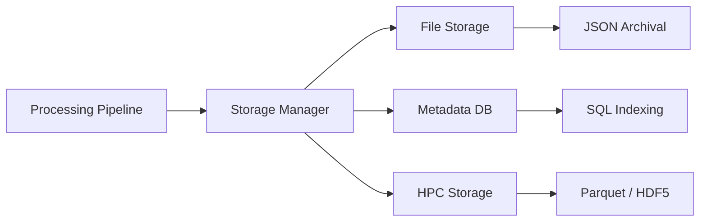

# Technical Spec: Tiered Storage Architecture

The SignVerse OS employs a multi-tiered persistence layer designed for scalable motion archival and high-performance machine learning training.

## 🗄️ Storage Tiers

### 📁 Tier 1: Archival (Files)
- **Raw Ingress**: Permanent storage of source video files (`.mp4`, `.avi`) in `data/raw/`.
- **Processed JSON**: Frame-level metadata and raw skeleton landmarks stored as compressed JSON in `data/processed/poses/`.

### 🗃️ Tier 2: Indexing (Metadata DB)
- **Structured Retrieval**: Powered by SQLAlchemy (PostgreSQL-ready), the metadata database indexes every video, frame, and tracked person.
- **Behavioral Queries**: Enables sub-millisecond retrieval of temporal segments based on person ID, interaction type, or confidence score.

### 🏎️ Tier 3: Performance (HPC)
- **Vectorized Formats**: Synchronized storage of multi-person trajectories in **Apache Parquet** and **HDF5**.
- **ML-Ready**: Optimized for high-throughput data loaders in PyTorch and TensorFlow.
- **Compression**: Utilizes **SNAPPY-compression** for Parquet to reduce disk I/O during massive dataset training.

## 🏗️ Storage Manager Orchestration

The [StorageManager](file:///c:/Users/User/Documents/Sign-Verse/core/storage/storage_manager.py) acts as a unified coordinator across all tiers:

### 🛰️ Data Persistence Lifecycle
1. **Ingest**: Raw processing frames are saved to the File Tier.
2. **Index**: Frame metadata is propagated to the DB Tier.
3. **Trajectorize**: On video completion, the manager compiles full person trajectories from the index.
4. **Export**: Finalized trajectories are saved to the HPC Tier for machine learning.
